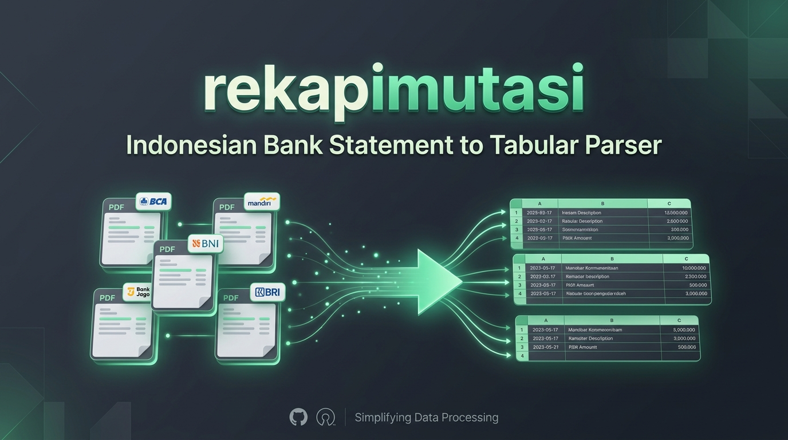

<p align="center">
  
</p>

<p align="center">
  <strong>Alat bantu konversi mutasi rekening & e-statement bank-bank di Indonesia (PDF / CSV) menjadi tabel data yang rapi dan terstruktur (<code>.xlsx</code>, <code>.csv</code>, <code>.json</code>).</strong>
</p>

<p align="center">
  <a href="#-fitur-utama">Fitur Utama</a> •
  <a href="#-bank-yang-didukung">Bank Didukung</a> •
  <a href="#-cara-menjalankan">Cara Menjalankan</a> •
  <a href="#-penggunaan-sebagai-python-library">Python Library</a> •
  <a href="#-struktur-proyek">Struktur Proyek</a> •
  <a href="#-lisensi">Lisensi</a>
</p>

<p align="center">
  <a href="https://ekmalrey.github.io/rekapimutasi/">
    
  </a>
</p>

<p align="center">
  
  
  
  
</p>

---

## ⚡ Fitur Utama

- 🔍 **Deteksi Otomatis Bank & Layout** — Cukup masukkan file mutasi, sistem akan otomatis mendeteksi jenis bank dan varian formatnya tanpa perlu konfigurasi manual.
- ⚡ **Parsing Teks Asli (Tanpa OCR)** — Mengekstrak teks langsung dari stream native dokumen PDF sehingga prosesnya instan, ringan, dan 100% presisi sesuai dokumen asli.
- 🎯 **Perhitungan Akurat Sampai Sen** — Semua operasi kalkulasi nominal menggunakan *integer math* (sen), bebas dari floating-point rounding error.
- 🔐 **Mendukung PDF Terenkripsi** — E-statement BCA berpassword (enkripsi AES-256) didekripsi langsung di *memory* tanpa pernah menulis file tidak terenkripsi ke disk.
- 📊 **Ekspor Siap Olah** — Hasil mutasi bisa langsung diunduh dalam format `.xlsx` (tipe angka asli, bukan teks), `.csv`, maupun `.json`.
- 🖥️ **Web UI & CLI Bawaan** — Dilengkapi Web UI modern dengan drag & drop dan preview dokumen asli berdampingan, serta CLI interaktif untuk automasi terminal.

---

## 🏦 Bank yang Didukung

| Bank | Format Dokumen | Status |
|---|---|:---:|
| **BCA** (Personal & Bisnis) | PDF e-Statement (AES-256) & CSV KlikBCA | ✅ |
| **Bank Mandiri** | PDF Tabungan (Layout klasik, e-Statement, Rekening Koran) | ✅ |
| **BNI** | PDF Tabungan (3 varian layout) | ✅ |
| **BRI** | PDF Rekening Koran | ✅ |
| **BSI** | PDF Tabungan | ✅ |
| **Bank Jago** | PDF Mutasi Bulanan (ID & EN) & Riwayat Kantong/Pockets | ✅ |
| **BTPN / Jenius** | PDF e-Statement | ✅ |

> 💡 **Ingin menambahkan parser bank lain?** Sangat mudah! Cukup buat satu class baru yang mengimplementasikan `Parser` (`bank`, `can_parse`, `parse`) lalu daftarkan ke registry bawaan.

---

## 🚀 Cara Menjalankan

### 1. Menggunakan Docker (Paling Cepat)

```bash
docker compose up --build
```
Setelah container aktif, buka **http://localhost:8092** di browser favoritmu.

---

### 2. Menjalankan Manual (Python)

Pastikan kamu sudah menginstal **Python 3.10+**:

```bash
# Siapkan virtual environment
python -m venv .venv
source .venv/bin/activate  # Di Windows: .venv\Scripts\activate

# Install dependencies
pip install -r requirements.txt
```

#### Jalankan Web UI
```bash
python -m rekapimutasi.web --addr :8092
```

#### Jalankan via Terminal (CLI)
```bash
# Simpan hasil parse ke file Excel
python -m rekapimutasi -o hasil_mutasi.xlsx statement.pdf

# Atau simpan langsung ke file CSV
python -m rekapimutasi -o hasil_mutasi.csv statement.csv

# Tampilkan ringkasan mutasi langsung di terminal
python -m rekapimutasi statement.pdf
```

---

## 💻 Penggunaan sebagai Python Library

`rekapimutasi` bisa diintegrasikan langsung ke dalam script, worker, atau backend service kamu:

```python
import rekapimutasi

# Parse file PDF atau CSV mutasi
statement = rekapimutasi.parse_file("statement.pdf")

# Akses data rekening dan transaksi
for pocket in statement.pockets:
    print(f"Rekening/Kantong: {pocket.account_number} ({pocket.name})")
    for tx in pocket.transactions:
        print(f"[{tx.date}] {tx.mutation_type:<2} Rp{tx.amount.value:>10,} — {tx.transaction_detail}")
```

---

## 📁 Struktur Proyek

```
rekapimutasi/
├── __init__.py          # Entrypoint facade API (parse_file, parse_text)
├── extractor.py         # Ekstraksi teks dokumen & dekripsi AES-256 (pypdf)
├── export.py            # Konversi data ke XLSX, CSV, dan JSON
├── model.py             # Dataclass Statement, Pocket, Transaction, Money
├── parser.py            # Protokol Base Parser & Registry
├── utils.py             # Helper parsing tanggal & nominal (integer math)
├── banks/               # Modul parser per bank (BCA, Mandiri, Jago, dll.)
├── cli.py               # Runner command-line interface
├── web.py               # HTTP web server (stdlib)
└── web/index.html       # Antarmuka web frontend bawaan
tests/                   # Unit test & fixture sintetis
assets/                  # Logo & hero banner
```

---

## 🧪 Testing

Jalankan test suite bawaan:

```bash
python -m unittest discover -s tests -v
```

> **Catatan Pengujian:** Test suite bawaan menggunakan data sintetis (dummy) untuk melindungi privasi. Jika kamu ingin menambahkan test case dari file mutasi asli, simpan file PDF di direktori `banks/<bank>/testdata/`. File tersebut akan otomatis diikutsertakan dalam regression test dan aman karena sudah diabaikan oleh `.gitignore`.

---

## 📄 Lisensi

Didistribusikan di bawah lisensi [MIT](LICENSE).